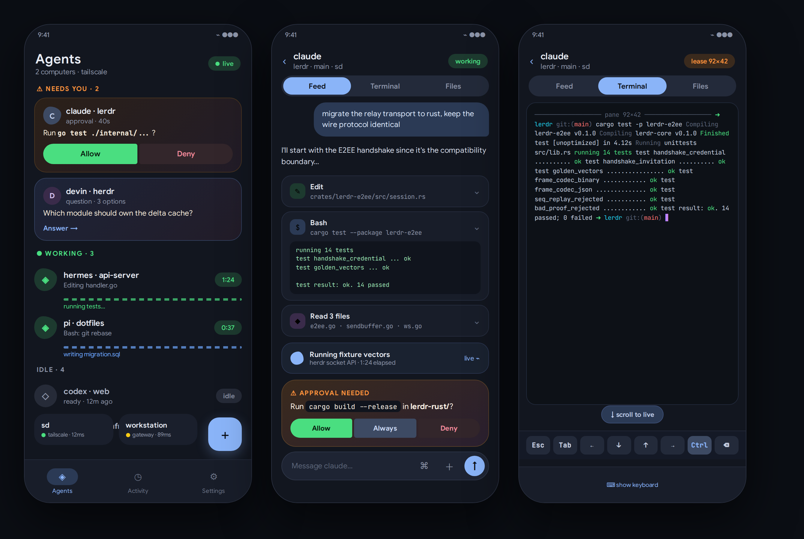

# lerdr-rust-kotlin

Migration plan for Lerdr: relay Go → **Rust**, Android app Tauri/WebView →
**Kotlin + Jetpack Compose (Material 3 Expressive)**.

This repo contains the plan only — no production code yet. Implementation
will live in the crates and Gradle modules these documents describe.

## Why

- **Rust**: one static binary per computer, no GC, with the concurrency
  profile the relay already proved it needs (pane watches, per-client
  queues, coalescing). The current Go model works; Rust makes it
  memory-auditable and cheaper to run on modest machines.
- **Native Kotlin**: no WebView. Real 60/120 fps rendering, native gestures,
  a real terminal keyboard, notifications and platform integrations without
  plugin IPC layers. The current app is a bundled web frontend; the new one
  is an experience designed for the phone that feels like sitting at the
  computer, with the same usage capability.

## The core idea

**The protocol is the boundary.** `protocol v3` over `herdr-e2ee-v2` is the
stable contract. That allows:

1. Building the Kotlin app against the existing Go relay (already deployed).
2. Building the Rust relay against the existing web app (already deployed).
3. Validating each half independently with cross-language golden vectors.
4. Cutting each side over independently — no big bang.

## Documents

| Doc | Contents |
|---|---|
| [00 — Inventory](docs/00-inventory.md) | What exists today: Go packages, actions, app features, native surface |
| [01 — Research](docs/01-research.md) | Reference apps and what to copy from each |
| [02 — Architecture](docs/02-architecture.md) | Rust crates, Kotlin modules, stack decisions |
| [03 — Protocol](docs/03-protocol.md) | Extracted wire contract: E2EE handshake, frames, actions, pane watch |
| [04 — App design](docs/04-app-design.md) | UX redesign with Material 3 Expressive, screen by screen |
| [05 — Roadmap](docs/05-roadmap.md) | Phases, deliverables, cutover criteria |
| [06 — Risks](docs/06-risks.md) | Technical risks and mitigations |
| [07 — Execution prompt](docs/07-execution-prompt.md) | Copy-paste master prompt + per-phase loops |

## Project rules

- **Protocol parity first**: no wire-format changes until both
  implementations coexist. Protocol improvements (binary codec on the E2EE
  path, compression, metadata diffing) go into a versioned protocol v2.
- **Golden vectors**: every cryptographic or parsing seam is pinned with
  fixtures generated from the current Go/TS implementation.
- **No capability regression**: the new app must do everything the web app
  does — the ~70-action catalog is the checklist.
- **Android-only client**: no PWA in scope. The Rust relay is a pure
  WS+API backend — no `web/` asset pipeline. (Consequence: iOS and desktop
  browsers lose a client; the existing Go+PWA stack can keep serving them
  in parallel if desired, since the protocol is shared.)
