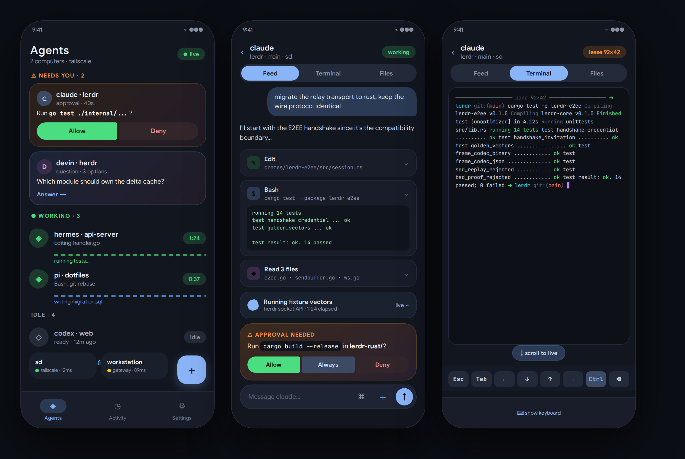

# 04 — App design: a native Lerdr experience



Design intent: **sit at the computer from the phone**. Two renderers over
one stream — a semantic feed that answers *what is the agent doing / what
does it need*, and a full-fidelity terminal that answers *let me drive*.
Neither is a fallback for the other; both are first-class.

The app is **Android + Kotlin only** — no PWA target. That frees the
design to lean fully into Compose/M3E: predictive back, foreground
service realtime, OEM-aware notification strategy, and no web-compat
lowest-common-denominator anywhere.

## Navigation model

```
┌────────────────────────────────────────────┐
│  Home (mission control)                    │
│  ├─ Needs-you rail  (attention inbox)      │
│  └─ Agents          (grouped by workspace) │
├────────────────────────────────────────────┤
│  Computers          (connected relays)     │
├────────────────────────────────────────────┤
│  Agent session                             │
│  ├─ Feed     (semantic timeline — default) │
│  ├─ Terminal (full interactive)            │
│  └─ Details  (workspace, git, files, info) │
├────────────────────────────────────────────┤
│  Activity (cross-agent journal)            │
├────────────────────────────────────────────┤
│  Settings (relays, devices, push, voices)  │
└────────────────────────────────────────────┘
```

Bottom nav (M3E `ShortNavigationBar`): **Agents · Computers · Activity · Settings**.
Everything else stacks on top with predictive back.

## Screen: Home

- **Needs-you rail** (top, only when non-empty): horizontally scrolling
  attention cards — approval/question/chat kinds get distinct colors and
  iconography; card shows agent, workspace, the question preview, and an
  inline `ButtonGroup` with the top two choices. Answer without leaving
  home. This is the PagerDuty muscle: urgency you can triage.
- **Agent list**: grouped by `relay ▸ workspace`, pinned working agents
  with `WavyProgressIndicator` (the M3E signature), idle agents with quiet
  status chips. Swipe actions: right = open, left = stop (destructive, with
  confirmation haptic + undo snackbar).
- **Agent avatars**: provider logo glyph when the wire `agent` is a known
  CLI (claude/codex/gemini — simple-icons marks); letter monogram for
  plain shells and unknown providers.
- **FAB menu** (`FloatingActionButtonMenu`): New agent · New workspace —
  pairing lives on the Computers tab.

## Screen: Computers

- **Computers tab**: one row per connected relay — label, transport,
  live status/RTT, agent count; FAB pairs a new device. Read-only glance:
  fine management (reconnect/forget/rename/revoke) stays in Settings →
  Devices. Replaces the old relays carousel at the bottom of Home.
- Empty state: expressive illustration + "pair your first computer" CTA
  → QR scanner.

## Screen: Agent session — the core redesign

Top bar: agent name (editable), workspace breadcrumb, status chip,
connection dot. **Segmented control** in the app bar switches modes:
`Feed | Terminal | Files`.
When measured labels cannot fit at the current text scale, replace the segments
with a single-height current-mode button and a menu containing all three complete
labels and the selected-mode check. Keep the terminal viewport available.

The status chip always shows agent lifecycle, including `working` and
`blocked`; viewport dimensions stay in the Terminal metadata row and never
replace lifecycle status.

### Feed mode (default) — *what the agent is doing*

Data: `get_conversation_history` pages + `question`/attention events +
`activity` — NOT raw ANSI.

- **Timeline** of entries: user prompts (outgoing bubble, surface-variant),
  assistant text (markdown-rendered, code blocks with copy), tool calls as
  compact cards — tool icon, title (`Edit src/foo.ts`), expandable to
  input/output/diff. `Error` tools tinted error.
- **Working indicator**: when pane activity advances but no entry commits,
  show a live "thinking" row — morphing `LoadingIndicator` + latest tool
  name + elapsed.
- **The blocker card**: when `question`/attention arrives, a large
  expressive card pins above the composer — full `QuestionInteraction`
  form: single/multi-select as `ButtonGroup`s / choice chips, other-text
  field, back/next navigation, submit. Dismissible only by acting.
  This replaces "read the CLI prompt" entirely.
- **Jump-to-live**: `Terminal` segment or a "live output" affordance on
  the working indicator opens terminal mode.

### Terminal mode — *the machine itself*

- **Rendering**: cached ANSI row layouts on a Canvas; draw and expose only
  the visible viewport. Incoming frames continue to commit offscreen.
- **Live reading**: scrolling away, Find, selection, or **Pause live output**
  holds the displayed frame, including in-place TUI redraws. Clearing a
  selection keeps that reading frame. **New output · Return to live**
  resumes the latest frame; keyboard/font changes follow settled bounds.
- **Special keys**: pinned Ctrl and horizontally scrollable Esc, Tab, arrows,
  Enter and Backspace. **More terminal keys** exposes every key and Ctrl
  combinations without horizontal hunting. Ctrl then an ASCII letter
  sends the chord without altering the draft; Ctrl+C and Ctrl+D require
  confirmation. Disconnecting clears pending chords and confirmations.
- **Editor**: local text, caret and selection survive keyboard hide/show.
  Send is single-flight and clears only the unchanged submitted draft
  after completed delivery. Failed or unconfirmed delivery retains it;
  nothing queues for automatic resend. Secret drafts remain masked,
  non-saveable, and never fall back to ordinary text submission.
- **Connection state**: Controlling, Observing (read-only), Connecting,
  Reconnecting and Offline remain visible. Offline controllers can edit a
  draft, but sending and terminal keys are disabled; Readers cannot edit.
- **Phone geometry**: `adjustResize` preserves the header and editor above
  the IME. Measured columns/rows lease the native VT and PTY together for
  OpenCode, Codex, omp and other providers, independent of desktop split
  size. Renew the requested phone grid, not a temporary peer minimum.
  Observers do not resize. Release on hide/background; see doc 08 for
  arbitration and the shared-PTY desktop reflow tradeoff.
- **Reading size**: pinch and **Text size** share persisted 0.25–2.5× bounds.
  **Fit width** is optional for wide cached/observed output; **Actual size**
  restores the normal scale. Horizontal scrolling remains available.
- **Selection and Find** use the displayed frame. Copy selection/line,
  copy/share transcript and row URL actions remain local. Closed or empty
  Find and ordinary context-menu opening do not flatten the transcript;
  whole-transcript text is built only for an explicit search or copy/share.

### Details mode

- Workspace info, cwd chip (copiable), git status card (branch, ahead/
  behind, dirty files → tap for diff viewer), file tree (lazy), agent
  metadata (session id, started, kind), actions: rename / restart /
  clear / stop — the `ManageDialog` surface, redesigned as a sheet.

## Composer (shared across modes)

Autosize field, per-agent drafts, attach button (camera/gallery/files →
chunked `upload_*` with progress cards), slash-command autocomplete
(bottom-sheet picker with search — `list_slash_commands`), voice input
(STT → text). Send = `submit_prompt` for Feed. Terminal uses its local
draft editor and completed-delivery policy above. Reader role hides
mutating Feed affordances; Terminal retains inert controls and an explicit
read-only state.

## Notifications → deep links

- Channels per urgency: `agent_attention` (high), `agent_activity` (low),
  `service` (foreground, low).
- Tapping a notification resolves `push_open_ref` → navigate straight into
  the agent's blocking question — one tap from shade to answer.
- Swipe-to-snooze maps to `push_snooze`; "viewed" suppression via
  `push_viewed_pane` when the pane is foreground.

## Settings

- **Relays**: card per computer — URL/transport, latency, version,
  reconnect; add via QR or paste link; per-relay push policy editor.
- **Devices**: this device + paired list (rename/revoke), create
  invitation QR for a new phone (controller or reader).
- **Speech**: voice catalog, install/remove, language chips.
- **App**: biometric lock toggle, theme mode (system/light/dark),
  update check/install (GitHub latest release → DownloadManager →
  package installer), diagnostics export.

## Motion & theming (M3 Expressive)

- `MaterialExpressiveTheme` + `motionScheme()` — spring physics defaults.
- Brand palette (`LerdrDarkColorScheme` / `LerdrLightColorScheme`, tuned
  against `docs/mockup.png`) is the default in both light and dark —
  dynamic (wallpaper) Material You color is off by default so the
  mission-control identity doesn't wash out on an arbitrary wallpaper;
  it stays available as an internal toggle for future exposure, but is
  not wired to a Settings switch today.
- Morphing shapes on status indicators (working = wavy, waiting = pulsing
  "cookie" shape, error = sharp).
- Predictive back; shared-axis transitions list→detail; attention cards
  animate in with `animateItem` + spring.

## Feature reachability checklist

Every current catalog action must have an intentional UI reach or an explicit
capability-gated omission: agents CRUD/reorder, workspaces + tabs + worktrees
CRUD, send text/keys/secret/prompt/respond, questions
(answer/navigate/clarify), uploads batch, conversation history + search,
workspace tree/file/git, activity journal + copy response, push subscribe/
policy/snooze/test/viewed, device list/rename/revoke/invite/reset,
speech voices + speak/cancel, update check/install, slash commands, QR
pairing, pane lease, and the current Tailscale transport.

Current reachability is narrower than that product checklist:

- Workspace rename has repository/API plumbing, but no production UI caller.
- Attachment documents and images use the system document picker; there is no
  attachment-camera launcher. QR camera scanning is a separate flow.
- Question clarification needs a genuine provider form exposing `can_chat`;
  the audited Codex multi-question form supports answer/next/back, not clarify.
- Activity is a bounded refresh/filter view, not a paginated or clear-history
  screen. Response copy is omitted when the peer lacks its capability.
- Diagnostics export has no production UI entry.

These gaps are not feature acceptance or permission to synthesize capabilities.

## Accessibility & quality bars

- All interactive elements ≥48 dp, content descriptions on icon-only
  controls, live regions on attention cards.
- Terminal: minimum 10sp effective font; zoom ceiling per lease caps.
- Reader mode is fully usable — not a disabled afterthought.
- Battery: single multiplexed WS per relay, lifecycle-aware watch
  (unwatch on background, re-watch + re-lease on resume), WorkManager for
  nothing — the socket *is* the realtime channel.
